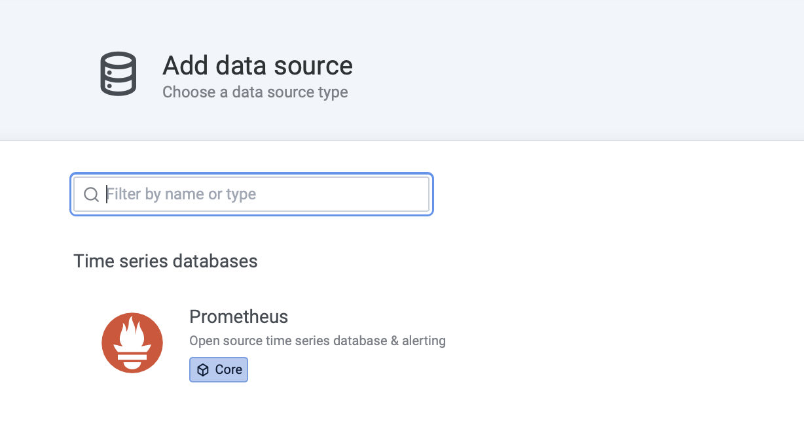
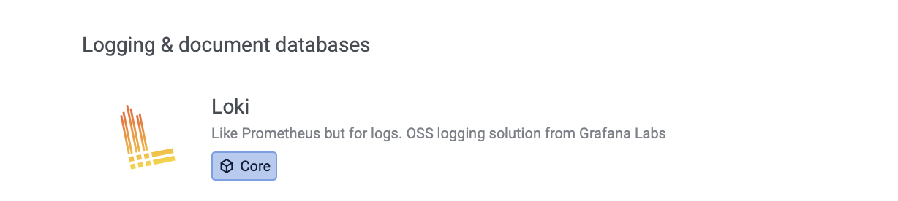
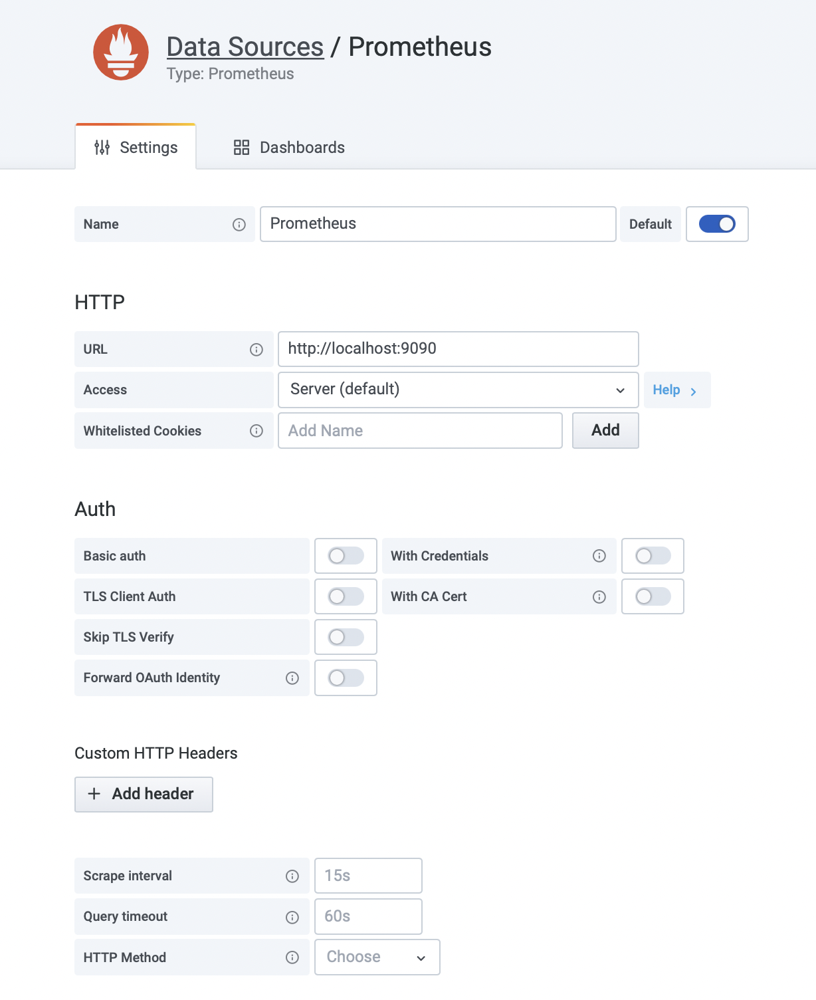
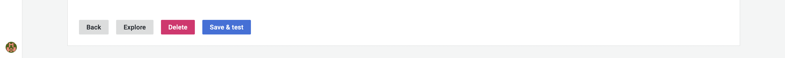
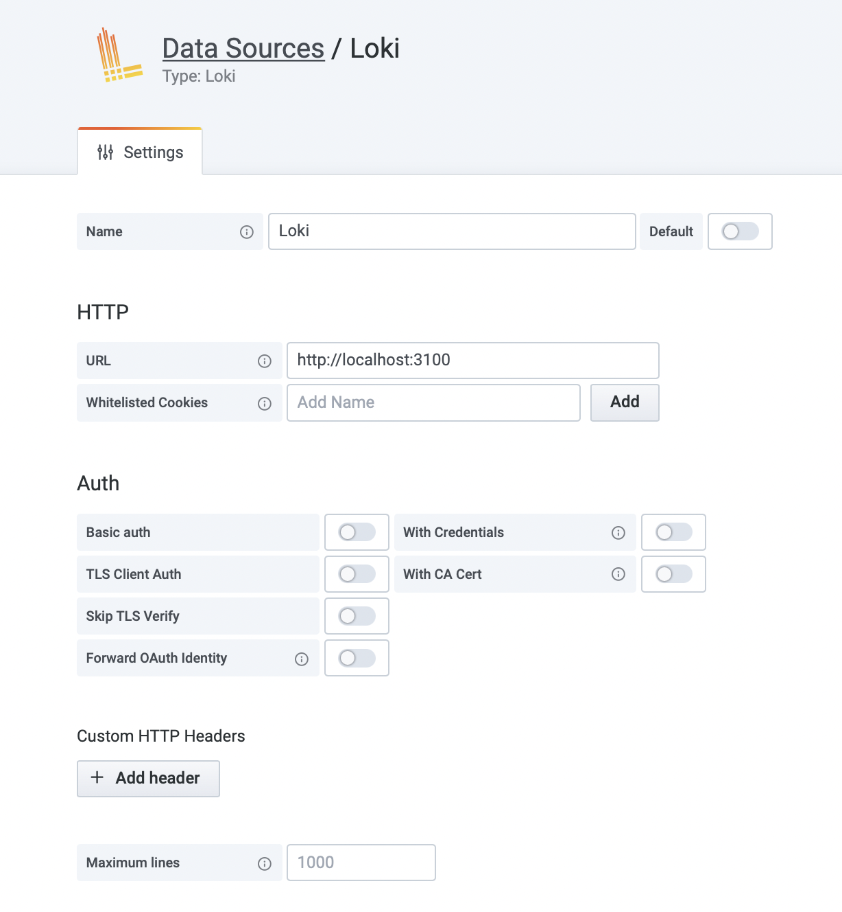
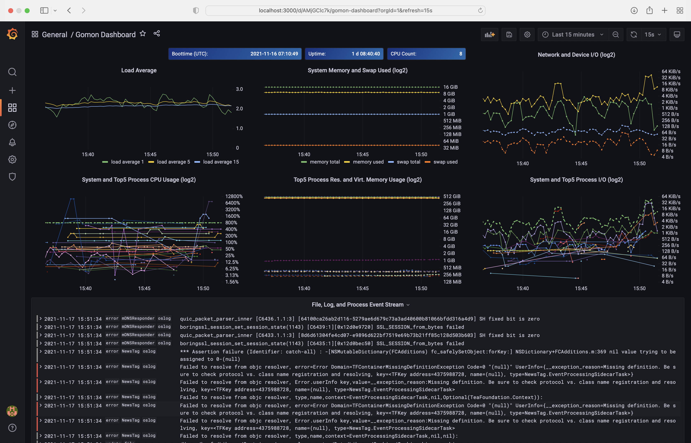
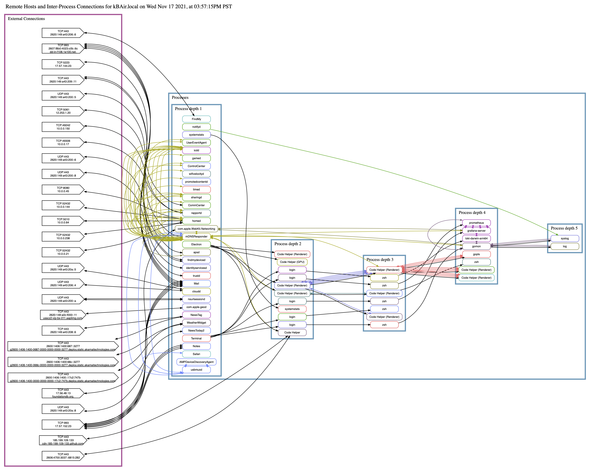

Copyright © 2021 The Gomon Project.

# Welcome to *Gomon*, the *Go* language based system *mon*itor


- [Welcome to *Gomon*, the *Go* language based system *mon*itor](#welcome-to-gomon-the-go-language-based-system-monitor)
- [Overview](#overview)
- [Installing *Gomon*](#installing-gomon)
- [Employing *Prometheus*, *Loki*, and *Grafana*](#employing-prometheus-loki-and-grafana)
  - [Prometheus](#prometheus)
  - [Loki](#loki)
  - [Grafana](#grafana)
- [Putting it all together](#putting-it-all-together)
  - [*Add data sources* for *Prometheus* and *Loki* to *Grafana*](#add-data-sources-for-prometheus-and-loki-to-grafana)
  - [Configure the *Prometheus* data source](#configure-the-prometheus-data-source)
  - [Configure the *Loki* data source](#configure-the-loki-data-source)
  - [Install the *Gomon Dashboard* to *Grafana*](#install-the-gomon-dashboard-to-grafana)
  - [Start the servers](#start-the-servers)
    - [*Prometheus*](#prometheus-1)
    - [*Loki*](#loki-1)
    - [*Grafana*](#grafana-1)
    - [*Gomon*](#gomon)
- [Visualize!](#visualize)
  - [Gomon Dashboard](#gomon-dashboard)
  - [Inter-process and remote host connections](#inter-process-and-remote-host-connections)
  
# Overview

The `gomon` command starts itself as a server that monitors its system. *Gomon* periodically measures the state of the system, including its CPU, memory, filesystems, network interfaces, and processes. *Gomon* also observes system logs and the system's management of files and processes. Hence, gomon's processing consists of two fundamental operations: **measurement** and **observation**.

What *gomon* **measures** of the system is performed through kernel interfaces that report the state of resources of the system: the CPU, the memory, the filesystems, the network interfaces, and the processes.

What *gomon* **observes** of the system are reports of events captured by the logging, file management, and process management subsystems. While *gomon* cannot observe the events directly, it assumes that the subsystems' reporting is timely. A potential enhancement to *gomon* would be for it to initiate periodically its own log, file, and process events to sample the lag between initiation and reporting of events. This could dovetail nicely with *gomon*'s measurement operation.

Gomon records its measurements and observations and reports them in a message stream. By default, *gomon* streams these messages as JSON objects to standard out. 

Analysis of *gomon*'s message stream may yield insights into the system's operations through discovery of event patterns and interrelationships and what these signify about the condition and operation of the system. An excellent application for stream analysis and visualization is *[Grafana](https://grafana.com)*. Together with *[Prometheus](http://prometheus.io)* to record the measurements, and *[Loki](https://grafana.com/oss/loki/)* to record the observations, *Grafana* can chart the measurements and report the observations. Look in the `gomon/assets` folder for sample configuration files for *[Prometheus](assets/prometheus.yml)* and *[Grafana](assets/grafana/dashboard.json)* to enable this scenario.

The inspection of process relationships is also available if *[Graphviz](https://graphviz.gitlab.io)* is installed. *Gomon* can use *Graphviz* to render a web view of the inter-process and remote host connections of the system.

# Installing *Gomon*

To set up *Gomon*, first download and install *[Go](https://golang.org/dl/)*. Then proceed with the following Terminal commands to download and install *Gomon*. *(On [macOS](https://www.apple.com/macos/), you may be prompted to install the [Xcode Command Line Tools](https://developer.apple.com/download/more/?=Command%20Line%20Tools).)*
```zsh
git clone https://github.com/zosmac/gomon
cd gomon
go mod tidy
go generate ./...
go install ./...
```
As performing several of the measurements and observations requires root authority, use `sudo` to invoke `gomon`. 
```zsh
sudo gomon -pretty
```
*(Alternatively, assign the executable to root and grant it setuid permission)*
```zsh
sudo chown 0:0 $(which gomon)
sudo chmod u+s $(which gomon)
gomon -pretty
```
*Gomon* periodically (default every 15s) makes system measurements and gathers observations, consolidating these into a *stream* that it writes to standard out as JSON objects.

To view all the flags that the `gomon` command accepts for configuration, enter `gomon -help`. To see all the metrics that *Gomon* captures, enter `gomon -document`.

# Employing *Prometheus*, *Loki*, and *Grafana*

Follow these steps for deploying the three servers that record measurements and observations to facilitate visualization. Building these servers depends on two Javascript applications, the *[Node](https://nodejs.org)* runtime and the *[Yarn classic](https://classic.yarnpkg.com)* package manager. Download the current [Node installer](https://nodejs.org/en/download/current/) for your system and install. Then use the Node Package Manager (npm) to install Yarn:
```zsh
sudo npm install -global yarn
```

## Prometheus

*[Prometheus](http://prometheus.io)* is an open-source systems monitoring server for scraping and storing time-series data. At startup, *Gomon* opens a `/metrics` endpoint for *Prometheus* to collect *Gomon*’s system resource *measurement stream*.

To install *Prometheus*, select an appropriate binary from the [Prometheus download page](https://prometheus.io/download/) for your Operating System and Architecture, download, and install it.

To enable collection, open the `prometheus.yml` configuration file for the *Prometheus* deployment and add the following to `scrape_configs` *(a sample configuration file is in [`assets/prometheus.yml`](assets/prometheus.yml))*: 
```yml
  - job_name: "gomon"
    static_configs:
      - targets: ["localhost:1234"]
```

## Loki

*[Loki](https://grafana.com/oss/loki/)* is an open-source log aggregation server. Via *Gomon*’s HTTP POSTs to the `/loki/api/v1/push` endpoint, *Loki* can receive the *observations*. To install *Loki*, create a `loki` folder, select appropriate `loki` and `promtail` binaries from the list of Assets on the [Loki releases page](https://github.com/grafana/loki/releases/latest) for your platform, and download. Each binary also requires a configuration file; follow the instructions on the [Loki installation page](https://grafana.com/docs/loki/latest/installation/local) to copy these to the `loki` folder.
```zsh
cd ${LOKI_DIR}
unzip =(curl -L "https://github.com/grafana/loki/releases/latest/download/loki-$(go env GOOS)-$(go env GOARCH).zip")
unzip =(curl -L "https://github.com/grafana/loki/releases/latest/download/promtail-$(go env GOOS)-$(go env GOARCH).zip")
chmod a+x loki-$(go env GOOS)-$(go env GOARCH) promtail-$(go env GOOS)-$(go env GOARCH)
curl -O -L "https://raw.githubusercontent.com/grafana/loki/main/cmd/loki/loki-local-config.yaml"
curl -O -L "https://raw.githubusercontent.com/grafana/loki/main/clients/cmd/promtail/promtail-local-config.yaml"
```

## Grafana

*[Grafana](https://grafana.com/oss/grafana)* is an open-source server that can query and display *Prometheus* time-series data and *Loki* aggregated logs. Together these three servers provide an excellent front-end for *Gomon*.

To install *Grafana*, select an appropriate binary from the [Grafana download page](https://grafana.com/grafana/download) for your platform, download, and install it.

# Putting it all together

## *[Add data sources](http://localhost:3000/datasources/new)* for *Prometheus* and *Loki* to *Grafana*

<br>


## Configure the *Prometheus* data source

*Note that while the Data Source's Settings Panel shows the default data source URL, you must still type it into the URL field. Then, scroll down and select* **Save & test.**

<br>


## Configure the *Loki* data source

*Note that while the Data Source's Settings Panel shows the default data source URL, you must still type it into the URL field. Then, scroll down and select* **Save & test.**

<br>


## Install the *[Gomon Dashboard](assets/grafana/dashboard.json)* to *Grafana*
```zsh
curl ${GRAFANA_CRED} -X POST -i -w "\n" -H "Content-Type: application/json" -T ${GOMON_DIR}/assets/grafana/dashboard.json "http://localhost:3000/api/dashboards/db"
```

## Start the servers

### *Prometheus*
```zsh
cd ${PROMETHEUS_DIR}
./prometheus >prometheus.log 2>&1 &
```

### *Loki*
```zsh
cd ${LOKI_DIR}
./loki-$(go env GOOS)-$(go env GOARCH) -config.file loki-local-config.yaml >loki.log 2>&1 &
```

### *Grafana*
```zsh
cd ${GRAFANA_DIR}
bin/$(go env GOOS)-$(go env GOARCH)/grafana-server web >grafana.log 2>&1 &
```

### *Gomon*
```zsh
sudo gomon -pretty -port 1234
```

# Visualize!

## Gomon Dashboard

[](http://localhost:3000)

## Inter-process and remote host connections

If *[Graphviz](https://graphviz.gitlab.io)* is installed, *Gomon* can render a view of the inter-process and remote host connections via the `/gomon` endpoint.
[](http://localhost:1234/gomon)
To download and install *[Graphviz](https://graphviz.org/download/source/)*, select a stable release, download its tar file, and build and install it.
```zsh
tar xzvf =(curl -L "https://gitlab.com/api/v4/projects/4207231/packages/generic/graphviz-releases/3.0.0/graphviz-3.0.0.tar.gz")
cd graphviz-3.0.0
./configure
make
sudo make install
```
*(Note: installing from the git repository (i.e. `git clone https://gitlab.com/graphviz/graphviz/`) requires pre-configuration with `autogen.sh`, which in turn requires GNU autoconf, automake, and libtool. Find details at https://graphviz.org/download/source/#git-repos)*
